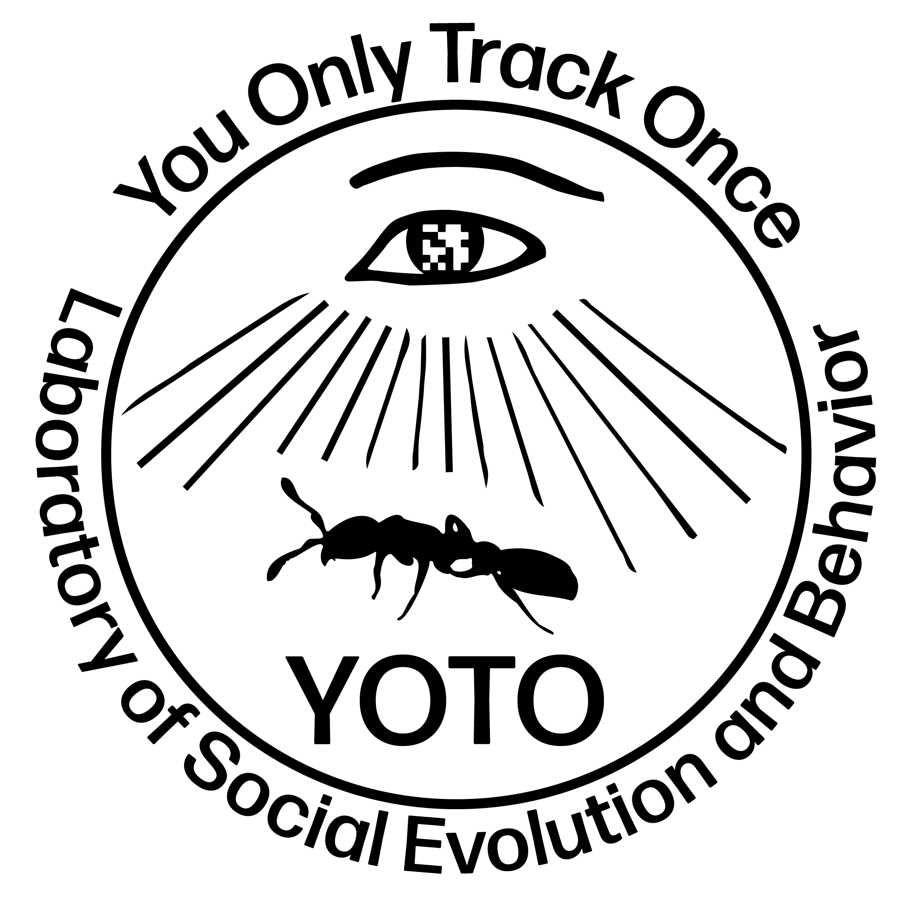

<p align="center">
  <picture>
    <source media="(prefers-color-scheme: dark)" srcset="docs/assets/YOTO-LOGO-W.png">
    
  </picture>
</p>

<h1 align="center">YOTO</h1>

<p align="center">GPU-accelerated AprilTag tracking pipeline for ant behavioral studies.</p>

<p align="center">
  <a href="https://github.com/Social-Evolution-and-Behavior/yoto/actions/workflows/ci.yml"></a>
  <a href="https://github.com/Social-Evolution-and-Behavior/yoto/releases"></a>
  <a href="https://opensource.org/licenses/MIT"></a>
  <a href="https://github.com/psf/black"></a>
</p>

YOTO is a hybrid pipeline for fast and reliable tracking of fiducial-marked insects. Running AprilTag directly on a high-resolution video frame is slow, because the decoder scans the whole image looking for quads. YOTO splits the work into two stages and only runs the expensive decoder on the parts of the frame that matter:

1. **Stage 1 — YOLO detection.** A lightweight YOLO model trained on a small (auto-generated) dataset locates marker regions in the full frame. YOLO is fast and accurate at finding small tags in large images.
2. **Stage 2 — AprilTag decoding.** Detected regions are cropped and packed into a compact composite, and the AprilTag library decodes tag IDs from that composite. Restricting AprilTag to small cropped regions preserves its decoding accuracy while drastically reducing its cost.

In a reference benchmark, 5 days of 10 fps 4512×4512 footage of 100 clonal raider ants was processed in under 9 hours — roughly a week's worth of compute on a classical full-frame AprilTag pipeline.

## Features

- **Two-stage detection** (YOLO → AprilTag): an order-of-magnitude faster than running AprilTag on full frames, with fewer false positives in busy scenes
- **End-to-end pipeline**: `detect → clean → render` — raw decode, automatic gap-filling and jump-detection on trajectories, and overlay-video rendering
- **GPU end-to-end**: NVDEC decode → YOLO inference → AprilTag → NVENC encode; threaded ffmpeg render ~2–3× faster than single-threaded `cv2.VideoWriter`
- **Batch processing**: `--parallel N` on `detect` / `render` dispatches one worker per video via GNU parallel, with a live human-readable `progress.txt`
- **YOLO-fill gap recovery**: undecoded YOLO boxes are stitched into each tag's trajectory via a forward+backward chain matcher with collision resolution — recovers tag positions on frames where AprilTag failed to decode
- **Configurable tag family**: `yoto detect --tag-family` swaps the AprilTag family (default `tag36ARTag`)
- **Retraining workflow**: `yoto train` builds testsets, tunes AprilTag presets with Optuna, and curates YOLO / tag-classifier training sets — see [the training guide](docs/guides/training.md)
- **AprilTag presets**: swap detection parameters non-destructively via `--apriltag-preset` (built-in `ir` preset, plus support for any JSON file including Optuna `best_params*.json` dumps)
- **Auto px→mm calibration**: `yoto clean --tag-size` measures the median AprilTag side length from decoded corners and stores a `mm_per_px` scale on the clean pickle
- **Self-describing output**: every clean pickle carries a `df.attrs` block with the YOTO version, all knobs used, per-step counts, and the imaging scale — see [docs/guides/cleaning.md](docs/guides/cleaning.md#pickle-attributes)
- **CLI and Python API**: use from the command line or import into your analysis scripts

## Installation

YOTO needs Python 3.10 or newer, and is installed from a clone of this repository. Pick either recipe below — conda if you already use it, plain pip otherwise.

### With conda (recommended)

```bash
conda create -n yoto python=3.11 -y
conda activate yoto
git clone https://github.com/Social-Evolution-and-Behavior/yoto.git
cd yoto
pip install .
```

`pip install .` pulls in every Python dependency `detect`, `clean`, `render` and `train` need at runtime, and the default YOLO weights ship inside the package, so `--yoloweights` is optional. There are no extras to remember: the NVDEC detection pipeline and `yoto train optimize-preset` both work out of the box. The one optional extra is `".[engines]"` (`tensorrt`, `onnxruntime-gpu`), needed only if you run `.engine`/`.trt`/`.onnx` weights instead of the bundled `.pt`.

### AprilTag library

Two things are not pip-installable: **ffmpeg** (see [Requirements](#requirements)) and the AprilTag decoder itself. Build the [LSEB fork](https://github.com/Social-Evolution-and-Behavior/apriltag) from source, with the YOTO environment activated:

```bash
conda activate yoto
sudo apt install build-essential cmake

git clone https://github.com/Social-Evolution-and-Behavior/apriltag.git
cd apriltag

cmake -B build \
  -DCMAKE_BUILD_TYPE=Release \
  -DCMAKE_INSTALL_PREFIX="$CONDA_PREFIX" \
  -DPython3_EXECUTABLE="$CONDA_PREFIX/bin/python"

cmake --build build -j"$(nproc)"

cmake --install build
```

```bash
python -c "from apriltag import apriltag; print('apriltag ok')"
```

The two `-D` flags matter: `Python3_EXECUTABLE` pins the build to the environment's interpreter instead of the system `python3`, and `CMAKE_INSTALL_PREFIX` installs into the environment rather than `/usr/local`, where the Python module would land outside its `sys.path`.

## Quick Example

```bash
# Step 1: Detect tags (NVDEC fast pipeline + TensorRT engine, default)
yoto detect /path/to/experiment.mp4

# Step 2: Clean and interpolate the raw tracking data
yoto clean /path/to/experiment.mp4

# Step 3: Render the overlay video
yoto render /path/to/experiment.mp4
```

## Command Line

`detect`, `clean`, and `render` all accept a single video file, a recording directory, or a tree of recordings.

```bash
# Detection
yoto detect /path/to/experiment.mp4 --yoloweights /path/to/yolo.pt
yoto detect /path/to/experiment.mp4 --yoloweights /path/to/yolo.pt --apriltag-preset ir   # IR-illuminated footage
yoto detect /path/to/recordings/ --yoloweights /path/to/yolo.pt --parallel 3              # batch over a tree

# Cleaning
yoto clean /path/to/experiment.mp4
yoto clean /path/to/recordings/
yoto clean /path/to/recordings/ --parallel 3

# Overlay rendering
yoto render /path/to/experiment.mp4
yoto render /path/to/recordings/ --scale 0.5 --parallel 3
yoto render /path/to/recordings/ --raw --no-trails                # raw, uninterpolated
yoto render /path/to/experiment.mp4 --highlight-ids 42,87,103     # bold red labels for these IDs

# Retraining: AprilTag presets and YOLO weights
yoto train build-testset /path/to/recordings/                     # sample frames + ground truth
yoto train optimize-preset --testset-dir <testset>                # Optuna preset search
yoto train build-yolo-dataset /path/to/recordings/                # browser-reviewed YOLO training set
```

See [docs/guides/training.md](docs/guides/training.md) for the full retraining workflow.

Outputs land in a standard layout next to each video:

```
<recording>/tracking/raw_data/       # detect outputs
<recording>/tracking/clean_data/     # clean outputs
<recording>/tracking/video_output/   # render outputs
<recording>/tracking/logs/           # parallel worker logs
<recording>/tracking/training/       # yoto train testsets and datasets
```

### Checking parallel progress

Each parallel run creates a dated folder under `tracking/logs/`:

```
<input_root>/tracking/logs/yoto-parallel-<timestamp>/
├── progress.txt     # human-readable summary, refreshed every 3s
├── joblog.tsv       # GNU parallel joblog (one line per finished video)
└── <seq>-<stem>/    # per-worker stdout/stderr, one dir per video
```

While the run is live:

```bash
cat /path/to/progress.txt          # snapshot
watch -n 5 cat /path/to/progress.txt  # poll every 5s
```

The launch banner prints the exact path.

## Documentation

Full guides live under `docs/guides/` (detection, cleaning, video rendering, training, installation, quickstart). They render as plain Markdown on GitHub, but the project also ships an MkDocs site:

```bash
pip install ".[docs]"      # one-time
mkdocs serve               # live preview at http://127.0.0.1:8000
mkdocs build               # static site under ./site/
```

## Requirements

- Python ≥ 3.10
- NVIDIA GPU with CUDA support
- ffmpeg — built with NVENC encoders (`hevc_nvenc`, `h264_nvenc`) and `-hwaccel cuda` for the GPU render fast path; `libx264` + OpenCV decode are used as automatic fallbacks
- [AprilTag](https://github.com/Social-Evolution-and-Behavior/apriltag) (LSEB fork) — built from source, see [AprilTag library](#apriltag-library)

## License

[MIT](LICENSE)
